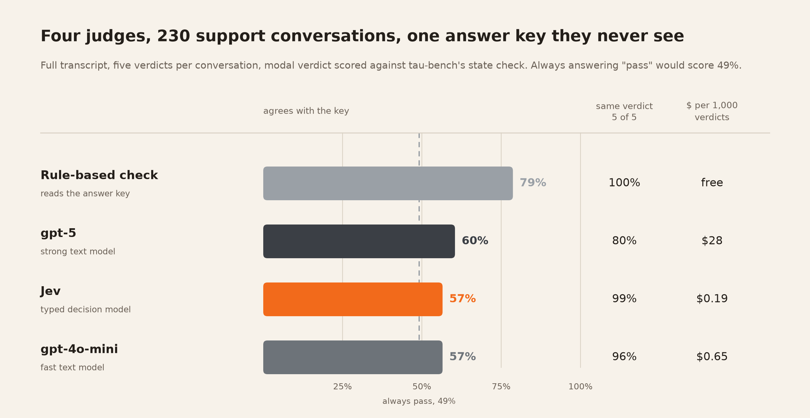
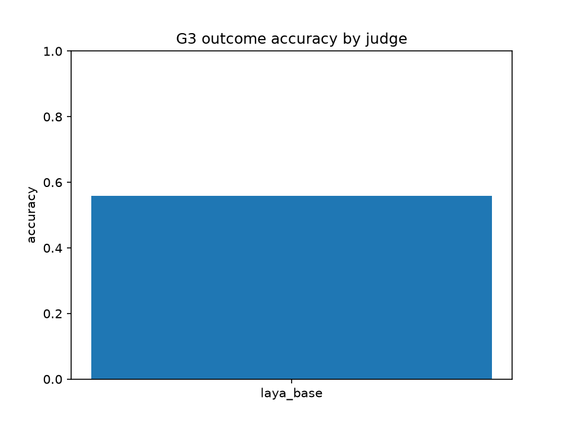
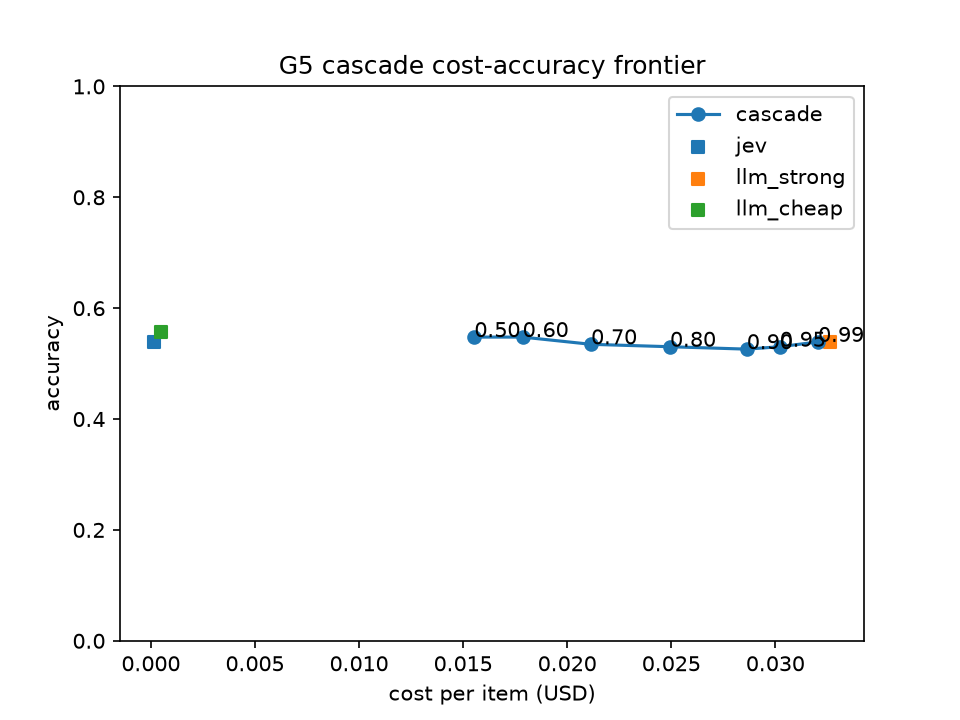
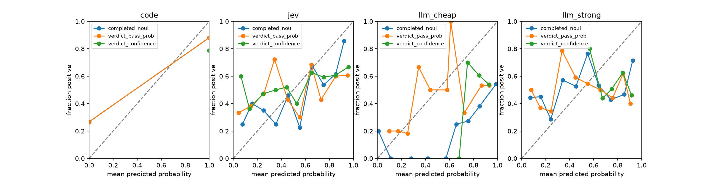
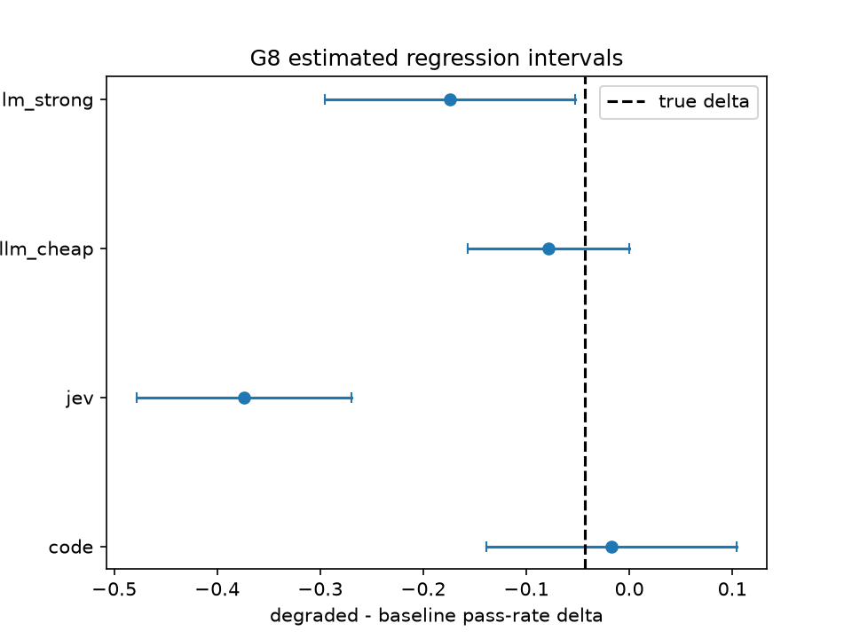

# Decision models as judges

Can a model grade an AI agent? This study puts four judges over 230 customer-support conversations and scores each against a ground truth none of them can see. Two are text models (gpt-5 and gpt-4o-mini), one is a typed decision model (Jev), and one is a rule-based check that reads the answer key and marks the ceiling. Every verdict is cached and committed, so all results reproduce offline with no paid call.



## What we found

- Against outcome truth, the model judges are a little better than guessing. gpt-5 agrees with the answer key on 60% of conversations, Jev and gpt-4o-mini on 57%, where always answering "pass" scores 49%. The rule-based check, which reads the answer key, scores 79%.
- The same accuracy hides different judges. gpt-4o-mini marks 88% of conversations as pass and catches one failure in five. Jev ranks a real pass above a real fail 73% of the time, the best of the three, and gives the same verdict on all five repeats for 99% of conversations. gpt-5 catches the most failures and is the least consistent.
- Jev and gpt-5 agree with each other (kappa 0.50) far more than with the truth (0.14 and 0.21). Both grade behaviour: when the rushed agent stops confirming before it acts, the truth drops 4 points, Jev's pass rate drops 37 and gpt-5's 17.
- The failures every model judge misses are detail errors: right kind of change, wrong item, variant, or payment method. The rule-based check caught 40 of those 44.
- Cutting tool results in the reading copy changed the results more than any choice of model. The first copy cut every tool result at 600 characters; gpt-5 then failed correct runs for "unsupported" facts that were in the tool output it never saw. With the copies whole, gpt-5 went from 54% to 60% and from the least to the most consistent text judge.
- No judge's stated confidence is usable as a probability without correction, and even corrected it does not separate right verdicts from wrong ones.
- Jev and gpt-5 tie on ranking quality. Per thousand verdicts, Jev costs $0.19 and answers in 0.17 s; gpt-5 costs $28 and takes 28 s.

The full analysis, with intervals, confusion matrices, and a decision table for choosing a judge, is in [docs/judge-comparison.md](docs/judge-comparison.md).

## How it works

Each of the 115 retail tasks in tau-bench's test set is run by a careful agent that confirms every change with the customer, and by a rushed agent told to act on the first version of a request. tau-bench's state check gives each of the 230 conversations a pass or fail from the final database state. Each conversation is written out as a transcript with every turn and every tool result whole and the answer removed; that transcript is all a judge sees. Every judge answers two questions about every transcript five times, and the study scores the modal verdict against the state check, then asks harder questions of the same verdicts: whether confidence means anything, whether a cheap judge can hand off to an expensive one, and whether the judges notice the rushed agent.

## Results

<!-- results:start -->
4/10 gates have results below. Cached inputs:

- `agent`: 231 cached files
- `judge`: 13751 cached files
- `state`: 4362 cached files

### Task triage before any run

Not run yet. Produce it with `judges judge --gate g1 ...`.

### Per-step tool-call scoring

Not run yet. Produce it with `judges judge --gate g2 ...`.

### Outcome judging

Judge 'code' had the highest outcome accuracy at 0.79 on the compact text. Modal agreement across repeats ranged from 0.92 to 1.00. USD cost per verdict is recorded in the spend ledger, not in this table.

| judge_id   | profile   |   n_items |   accuracy |      kappa |   f1_fail |   modal_agreement |   error_rate |   mean_input_tokens |   latency_p50 |   latency_p95 |
|:-----------|:----------|----------:|-----------:|-----------:|----------:|------------------:|-------------:|--------------------:|--------------:|--------------:|
| code       | compact   |       230 |   0.786957 |  0.571906  |  0.813688 |          1        |            0 |               0     |           0   |           0   |
| code       | full      |       230 |   0.786957 |  0.571906  |  0.813688 |          1        |            0 |               0     |           0   |           0   |
| jev        | compact   |       230 |   0.517391 |  0.0180014 |  0.678261 |          0.997391 |            0 |             854.087 |         241   |         332.2 |
| jev        | full      |       230 |   0.565217 |  0.136961  |  0.450549 |          0.996522 |            0 |            4610.78  |         169   |         280   |
| laya_base  | compact   |        69 |   0.536232 | -0.0625602 |  0.111111 |          1        |            0 |             261.841 |         771   |         949.4 |
| llm_cheap  | compact   |       230 |   0.547826 |  0.0989226 |  0.5      |          0.917391 |            0 |             834.901 |        2284.5 |        3495.1 |
| llm_cheap  | full      |       230 |   0.565217 |  0.141855  |  0.305556 |          0.986957 |            0 |            3940.58  |        2086   |        3204.1 |
| llm_strong | compact   |       230 |   0.534783 |  0.0545524 |  0.682493 |          0.978261 |            0 |             829.901 |       21191   |       39933.1 |
| llm_strong | full      |       230 |   0.604348 |  0.212388  |  0.547264 |          0.941739 |            0 |            3937.58  |       28335.5 |       59664   |



### Atomic questions versus one broad question

Not run yet. Produce it with `judges judge --gate g4 ...`.

### Confidence-gated cascade

A cascade asks the cheap judge first and only pays for the strong text model when the cheap judge is unsure.

The best cascade sets its confidence bar at 50%, reaches 62% accuracy at $0.01 per conversation, and sends 26% of conversations on to the strong text model. Sending every conversation to the strong text model reaches 60% accuracy at $0.03 per conversation, so the cascade costs 71% less while scoring about 1 point more. The fast text model on its own reaches 57% accuracy at $0.00 per conversation.

For someone choosing a judge, the cascade is worth it here: it stays within 1 point of the strong text model while costing far less per conversation.

|    t |   accuracy |   cost_per_item |   escalation_rate |   n |
|-----:|-----------:|----------------:|------------------:|----:|
| 0.5  |   0.617391 |      0.00804059 |          0.256522 | 230 |
| 0.6  |   0.604348 |      0.0105247  |          0.33913  | 230 |
| 0.7  |   0.595652 |      0.0121945  |          0.4      | 230 |
| 0.8  |   0.604348 |      0.0154057  |          0.513043 | 230 |
| 0.9  |   0.604348 |      0.0196952  |          0.652174 | 230 |
| 0.95 |   0.608696 |      0.0223633  |          0.752174 | 230 |
| 0.99 |   0.604348 |      0.0268114  |          0.934783 | 230 |

| judge      |   accuracy |   cost_per_item |
|:-----------|-----------:|----------------:|
| jev        |   0.565217 |     0.000193653 |
| llm_strong |   0.604348 |     0.0280089   |
| llm_cheap  |   0.565217 |     0.000651146 |



### Calibration

Calibration asks whether a judge's confidence means what it says: when a judge says 90%, it should be right about 9 times in 10.

The best case, Jev on its stated confidence in its own verdict, is off by 17 points on average, while the worst, the fast text model on its answer to "did the agent complete the request", is off by 44 points. A correction fitted on other conversations lowered the error for 12 of 12 judge-and-signal pairs, by about 18 points on average.

Every judge is off by more than 10 points, so no judge's confidence should be taken at face value here; a stated probability is a rough hint, not a number to act on. Fit the correction on separate conversations before trusting any of it.

| judge      | signal             |   n |      ece |    brier |   ece_after_isotonic |   brier_after_isotonic |
|:-----------|:-------------------|----:|---------:|---------:|---------------------:|-----------------------:|
| code       | completed_noul     | 230 | 0.213043 | 0.213043 |            0.0487918 |               0.165892 |
| code       | verdict_pass_prob  | 230 | 0.213043 | 0.213043 |            0.0487918 |               0.165892 |
| code       | verdict_confidence | 230 | 0.213043 | 0.213043 |            0.0804348 |               0.170357 |
| jev        | completed_noul     | 230 | 0.205809 | 0.257566 |            0.127307  |               0.224438 |
| jev        | verdict_pass_prob  | 230 | 0.283104 | 0.297627 |            0.0955251 |               0.229305 |
| jev        | verdict_confidence | 230 | 0.17153  | 0.245604 |            0.119082  |               0.226365 |
| llm_cheap  | completed_noul     | 230 | 0.443983 | 0.435332 |            0.0677796 |               0.244429 |
| llm_cheap  | verdict_pass_prob  | 230 | 0.364939 | 0.377335 |            0.053963  |               0.255742 |
| llm_cheap  | verdict_confidence | 230 | 0.363896 | 0.372418 |            0.0374808 |               0.246687 |
| llm_strong | completed_noul     | 230 | 0.215042 | 0.276913 |            0.122256  |               0.232437 |
| llm_strong | verdict_pass_prob  | 230 | 0.204494 | 0.26955  |            0.0965115 |               0.234211 |
| llm_strong | verdict_confidence | 230 | 0.224894 | 0.241945 |            0.0688118 |               0.195717 |



### Robustness to evaluator-directed text

Not run yet. Produce it with `judges judge --gate g7 ...`.

### Regression detection

The rushed agent skips confirming with customers; this experiment asks whether each judge notices that it does worse.

In the ground truth the rushed agent passed 4 points less often than the careful agent, a gap small enough to be hard to detect. The rule-based check saw a drop of 2 points, somewhere between 14 points worse and 10 points better. Jev saw a drop of 37 points, somewhere between 48 points worse and 27 points worse. The fast text model saw a drop of 8 points, somewhere between 16 points worse and no change. The strong text model saw a drop of 17 points, somewhere between 30 points worse and 5 points worse. Jev and the strong text model exaggerated the drop; the rule-based check and the fast text model missed it.

None of the judges reported a drop when shown two halves of the careful agent's own conversations. Jev and the strong text model treated the rushed agent's behaviour as failure rather than judging its results, so the drop they report is larger than the real regression; the true gap is so small that no judge pins it down well.

| judge      |   true_delta |   est_delta |        lo |         hi | detected   | covers_truth   | false_alarm   |
|:-----------|-------------:|------------:|----------:|-----------:|:-----------|:---------------|:--------------|
| code       |   -0.0434783 |  -0.0173913 | -0.13913  |  0.104348  | False      | True           | False         |
| jev        |   -0.0434783 |  -0.373913  | -0.478261 | -0.269565  | True       | False          | False         |
| llm_cheap  |   -0.0434783 |  -0.0782609 | -0.156739 |  0         | False      | True           | False         |
| llm_strong |   -0.0434783 |  -0.173913  | -0.295652 | -0.0521739 | True       | False          | False         |



### Failure taxonomy against hand labels

Not run yet. Produce it with `judges judge --gate g9 ...`.

### Local decision model: zero-shot versus fine-tuned

Not run yet. Produce it with `judges judge --gate g10 ...`.

### Threats to validity

- Every judge sees the same serialized state and answers the same rubric, so serialization and rubric choices bias all judges equally.
- LLM judges run at provider defaults with no per-judge prompt or temperature tuning.
- Jev's training data is described by TypeSafe as synthetic and cannot be verified from outside.
- Results cover one agent model and one domain, tau-bench retail, under two policy variants.
- tau-bench's strict state matching penalizes valid alternative solution paths, and it does so for every judge equally.
- Hand labels for the failure taxonomy come from a single annotator.
- Laya accepts 512 input tokens, which forces a compact state, so the fair local-model comparison is on compact states only.
- Fine-tuning uses 115 tasks, which is small; only cross-validated numbers are reported.
- Prices are public list prices as of the date on the pricing table and drift as providers change them.
- Jev is served through OpenRouter after TypeSafe paused direct signups, so its measured latency includes the gateway.
- Reward truth comes from tau-bench itself, so it is a proxy for task success rather than an independent human judgment.
- Cached runs fix one random seed per stage, so variance across seeds is not measured here.

### Reproduce

Render the committed results offline:

```
uv sync
make results
```

Regenerate every result from scratch, in order:

```
judges run-agent --variant baseline
judges run-agent --variant degraded
judges serialize
judges judge --gate g3 --profile full --judges code,llm_cheap,llm_strong,jev
judges judge --gate g3 --profile compact --judges code,llm_cheap,llm_strong,jev
judges judge --gate g3 --profile compact --judges laya_base
judges finetune-laya
judges judge --gate g3 --profile compact --judges laya_ft
judges judge --gate g2
judges judge --gate g4
judges judge --gate g7
judges judge --gate g1
judges judge --gate g9
judges judge --gate g10
judges analyze --gate g3 --profile full --profile compact
judges analyze --gate g5
judges analyze --gate g6
judges analyze --gate g8
make results
```
<!-- results:end -->


## Run it

The repository ships the 230 conversations, so you never have to generate them to test the judges. Two commands install the study and open the app.

```
uv sync --extra laya
make ui
```

Open the Run page and work through the seven steps that test the judges on the shipped conversations. Each step shows what it reads and writes, what it costs against the spend caps, and a live view while it runs. One `OPENROUTER_API_KEY` is needed only for the paid judges; set it in the app sidebar or export it before `make ui`. Regenerating the conversations with your own agent is optional and costs about $10. The same steps are available as commands for scripting; see the [runbook](docs/runbook.md).

## What the study does

### The conversations

The study ships 230 conversations between a customer and an AI support agent. Half come from a careful agent and half from a rushed agent, and each conversation carries a ground truth of pass or fail. The conversations are drawn from the retail part of the public tau-bench test set, where the ground truth is computed from the final state of the data rather than from anyone's opinion.

### Two reading copies

Each conversation has two reading copies. The full text carries every turn and every tool result whole, so a judge can check what the agent said against what its tools returned; it runs about 3,000 tokens. The short text runs about 400 tokens and keeps only the request, one policy line, the tool calls, and the final message. The short copy exists because the local model Laya reads at most 512 tokens, so every judge is also run on the short copy for one fair comparison.

### What a judge is asked

A judge reads one conversation and answers two questions in a single call. The first states "The agent completed the user request in line with the policy." and asks how strongly it holds. The second asks for a pass or fail choice against the outcome rubric. Each judge answers five times per conversation so the study can measure how consistent its verdicts are.

### The four batches

The judging step runs four batches: two agents by two reading copies. Each batch judges 115 conversations with the four judges above, 5 times each, for 2,300 verdicts, and the four batches together make 9,200. The app runs them in this order:

| Order | Agent | Reading copy |
| --- | --- | --- |
| 1 | careful | full |
| 2 | careful | short |
| 3 | rushed | full |
| 4 | rushed | short |

### The judges

Four judges have results in this repository:

- Rule-based check: code that compares the agent's tool calls and final message against the task's expected actions. It reads the answer key, so it marks the ceiling rather than being a judge anyone could deploy. Free.
- Fast text model: `openai/gpt-4o-mini`, reading the transcript and a rubric, writing a rationale and a pass/fail.
- Strong text model: `openai/gpt-5`, the same with longer reasoning.
- Jev: `jev-1.13`, a hosted typed decision model that answers the two questions with probabilities and writes nothing.

The code also supports Laya, an open-weights decision model that runs locally. It reads at most 512 tokens, which is why the short reading copy exists. Laya's run over the shipped conversations is partial (69 of 230) and its fine-tuning step has not been run, so it is excluded from the comparison in `docs/judge-comparison.md`.

### Resuming

Every verdict is cached the moment it completes, under a key of judge, model, rubric version, text hash, and repeat. Interrupting the run loses nothing, and rerunning does only the missing calls. Errored verdicts are retried rather than kept.

## Development

```
uv sync
make check
```

### Keys

One `OPENROUTER_API_KEY` covers the agent runs, the LLM judges, and Jev: TypeSafe paused direct signups on 2026-09-22 and serves Jev through OpenRouter. To call TypeSafe directly, set `TYPESAFE_API_KEY` and `[jev_route] provider = "typesafe"` in `config/study.toml`.
